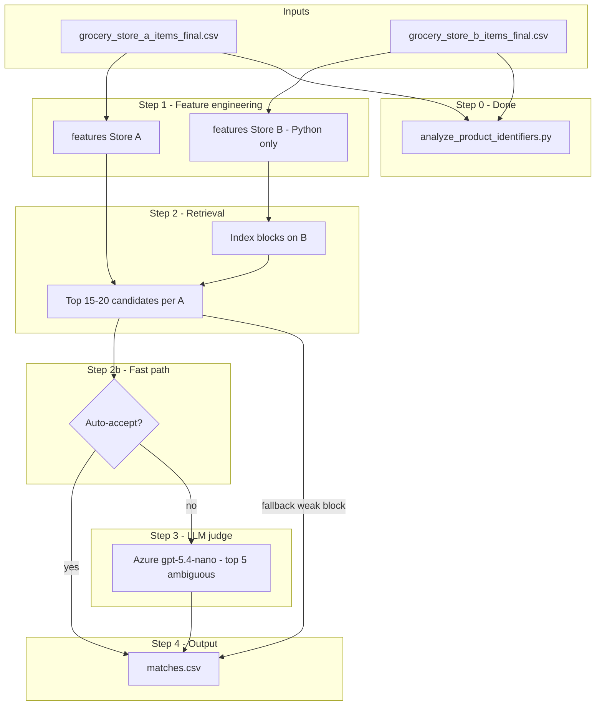

# Product Matching Pipeline — Architecture

This document describes how we match **Store A (Walmart)** products to the single closest **Store B (Wegmans)** product for the BetterBasket engineering assessment. It reflects data exploration already performed on the provided CSVs and a design that scales linearly without pairwise LLM calls.

---

## 1. Problem & deliverables

| Item | Detail |
|------|--------|
| **Inputs** | `grocery_store_a_items_final.csv` (233,199 rows), `grocery_store_b_items_final.csv` (55,516 rows) |
| Output | `matches.csv` with columns `item_id_A`, `item_id_B` |
| Coverage | **One best match per Store A product** (every A `item_id` appears exactly once) |
| Volume bar | At least **4,000** high-quality matches; full realistic matchable set is often cited as 10k+ |
| Code | Executable Python that reproduces the CSV |

### Match types (business rules)

**Exact match** — Same national-brand product: same brand, product, variant/flavor, size, and form. UPC is a shortcut when both sides have it; otherwise attribute and text matching apply.

**Non-exact match** — Different brands (typically both **private label**) but a shopper would treat them as the same item for pricing (e.g. Great Value organic tomato sauce 8 oz ↔ Wegmans organic tomato sauce 8 oz).

**Not a match** — Same brand but different variant (e.g. Chobani Honey vs Chobani Vanilla) is **not** exact; only a non-exact substitute if business rules allow (usually **no** for different flavors).

---

## 2. Data findings that drive design

Exploration scripts: `scripts/analyze_product_identifiers.py` → `analysis_output/identifier_analysis_report.txt`.

| Finding | Implication |
|---------|-------------|
| **No shared UPC/GTIN** across A and B (0 codes in A ∩ B) | No UPC-first cross-store stage; attribute + text matching is primary |
| **No dedicated UPC column**; rare digit runs in text | Do not rely on regex-only UPC matching |
| **Schema differs** (A: `item_type`, `is_private_label`; B: `is_organic`) | Load CSVs **by column name**, never by position |
| **Store-specific columns empty** (`is_private_label`, `is_organic`, `item_type`) | Infer PL / organic from name, brand, B `tags` |
| **Store A**: `brand_raw` often empty; size often only in `name` | A needs heavier normalization; optional LLM for hard rows |
| **Store B**: `brand_raw` populated; `sizing_comp` JSON reliable; `tags` on approx. 23k meaningful rows | Parse B with **local Python only** ($0) |
| **Categories differ by retailer** (`Food` vs `Grocery`, etc.) | Use categories as **soft** block hints, not exact join keys |
| **URL product ids** ≠ `datapoint_id` / `raw_data_id` | URL ids are internal per retailer; not used for A↔B matching |

---

## 3. Design principles

1. **No quadratic cost** — Never score all A × B (about 12.9B pairs). Target **O(|A| × K)** with small K (15–20).
2. **Asymmetric pipelines** — Python-first for B; more inference on messy A titles.
3. **Deterministic structure, probabilistic language** — Sizes, brands (when known), PL flags, and blocks are code; nuance and PL substitution go to the LLM **only when needed**.
4. **Do not block on exact LLM strings** — If LLM enrichment is used, keys are normalized and matching stays fuzzy inside blocks.
5. **Resumable & cacheable** — Feature files and judge outputs append to `.jsonl` so runs survive failures without duplicate API spend.
6. **Secrets** — `openai_creds.yaml` is local only; not committed. Prefer environment variables in production scripts.

---

## 4. High-level pipeline



---

## 5. Step-by-step specification

### Step 0 — Identifier analysis (complete)

- **Script:** `scripts/analyze_product_identifiers.py`
- **Purpose:** Confirm no cross-store UPC bridge; map schema and URL/id columns.
- **Output:** `analysis_output/identifier_analysis_report.txt`

### Step 1 — Feature engineering (local, asymmetric)

**Store B (Python only)**

| Field | Sources |
|-------|---------|
| `brand_normalized` | `brand_raw` |
| `size` | `sizing_comp.size_user_friendly` + regex fallback on `name` |
| `size_bucket` | Normalized numeric + unit (oz, fl oz, lb, count, each) |
| `is_private_label` | `brand_raw == Wegmans`, `wegmans_brand` / `Private Label` in `tags` |
| `is_organic` | `organic` in `tags` or name keywords |
| `category_coarse` | `item_info.category_0` + `category_1` (and `category_2` when present) |
| `form` | `frozen` / `fresh` / `refrigerated` from name, `storage_type`, tags |
| `variant_tokens` | Flavor/scent keywords from lexicon applied to `name` |
| `product_text` | Normalized title with brand/size tokens optionally stripped for similarity |
| `match_text` | String used for BM25 / RapidFuzz (brand + product_text) |

**Store A (Python first; LLM optional)**

| Field | Sources |
|-------|---------|
| `brand_normalized` | `brand_raw`, else longest match from brand vocabulary (built from B + known Walmart PL/national lists), else prefix heuristics (Great Value, Mainstays, …) |
| `size` / `size_bucket` | `sizing_comp` then regex on `name` |
| `is_private_label` | Walmart PL prefixes in name/brand list |
| `category_coarse` | `item_info` categories |
| `form` / `variant_tokens` | Same lexicon approach as B |
| `product_text` / `match_text` | Normalized `name` (strip HTML from `description` only when name is sparse) |

**Optional LLM batch extract (A only, sparse rows)**

- Run only when `brand_normalized` is unknown **and** local block would be huge.
- Output schema aligned with judge prompt fields; cached to `cache/a_llm_features.jsonl`.
- **Not** used as exact hash keys for blocking.

**Artifact:** `cache/store_b_features.jsonl`, `cache/store_a_features.jsonl` (one JSON object per line, keyed by `item_id`).

### Step 2 — Blocking & retrieval (local, $0)

**Block key (compound, relaxed)**

- Primary: `brand_normalized` (when both sides have a national brand candidate in block).
- Alternate path: **both PL** + `category_coarse` (bucket `category_1` or mapped grocery/pets/home) + `size_bucket` within ±20% (or same unit family).
- Do **not** block on `category_0` alone (taxonomy mismatch).

**Inside block**

- Rank B candidates with **RapidFuzz `token_set_ratio`** on `match_text` (order-insensitive).
- Optional: BM25 index per coarse block if blocks are large.
- Keep **top 15–20** `item_id_B` candidates per A row.

**Empty block fallback (widening)**

1. Drop size constraint, keep category + text similarity.  
2. Global fuzzy top-1 over all B (last resort; mark low confidence internally).  

Every A row must still receive one B id for the deliverable CSV.

### Step 2b — Rule-based fast path (local, $0)

Auto-accept **without LLM** when all conditions hold:

| Rule | Condition |
|------|-----------|
| National brand | `is_private_label` is false on **both** A and top B candidate |
| Brand equality | `brand_normalized` equal (same canonical string) |
| Size | `sizes_compatible` within about 5% relative or same discrete count |
| Variant | No conflicting variant tokens (honey vs vanilla, etc.) |
| Similarity | Top score ≥ **0.88** (tunable) |
| Margin | Top score − second score ≥ **0.05** |

**Never** fast-path private-label ↔ private-label substitution (send to LLM judge).

Write `(item_id_A, item_id_B)` and skip Step 3 for that row.

### Step 2c — Hybrid routing (`pick_match`)

Combines **earlier LLM gating** with **updated attribute safety**:

| Stage | Behavior |
|-------|----------|
| **Scoring pool** | Drop candidates with **definite** conflicts only: both sides have size and differ (e.g. 72 ct vs 62 ct), both have size labels and differ (NB vs Size 3), both have variant tokens and clash. Unknown size on one side stays in pool. |
| **Fast path** | National brand, same brand, both sizes present and compatible, no variant clash, score ≥ **0.88**, margin ≥ **0.05**. |
| **Garbage** | Score &lt; **0.50** → empty `item_id_B`. |
| **Local top-1** | If `not needs_llm_judge` (or `--skip-judge`): write top B when score ≥ **0.72** and no pool conflict. PL: skip LLM if score ≥ **0.84** and not a tie; national: ≥ **0.88**. |
| **LLM** | Borderline / ties per `needs_llm_judge`; top 5 candidates. |
| **LLM reject** | `match_found: false` → **empty** (no fallback to a conflicting top-1). |

BM25 + fuzzy run **after** `build_features.py`, on the per-row candidate pool only (see `score_candidates`).

### Step 3 — LLM judge (Azure OpenAI, scalpel only)

**When to call**

- `needs_llm_judge` is true: fast-path not met, and (PL↔PL with score &lt; 0.84 or tie) or (national/mixed with score &lt; 0.88 or tie).

**When not to call**

- Fast-path accepted, **or** local high-confidence path (score + margin above PL/national thresholds).

**Model & config**

- Azure endpoint and deployment from `openai_creds.yaml` (e.g. `gpt-5.4-nano`).
- Structured JSON response (`response_format` JSON object).

**Prompt inputs (per A row)**

- Target: engineered line — name, brand, size, PL flag, form, variant tokens, coarse category.
- Candidates: up to **5** B rows (not 3) with same fields + B `tags` snippet when relevant.

**Expected JSON shape**

```json
{
  "match_found": true,
  "chosen_item_id_B": "105999",
  "match_type": "exact",
  "reasoning": "Same national brand, size, and variant; titles differ in word order only."
}
```

`match_type`: `exact` | `non-exact` | `none` (if `match_found` is false, fall back to top local candidate or widening policy — document in README).

**Cache:** `cache/judge_results.jsonl` — append-only; resume by skipping A ids already judged.

**Concurrency:** Bounded async or thread pool with rate-limit backoff; never duplicate judge calls for cached ids.

### Step 4 — Output

- **File:** `matches.csv`  
- **Columns:** `item_id_A`, `item_id_B` (assessment minimum; optional internal `match_type` / `confidence` in cache only).  
- **Row count:** 233,199 (one per A row).  
- **Quality:** Expect well over 4,000 strong matches; manual spot-check recommended on PL and edge categories (pets, home decor).

---

## 6. Match-type decision logic (summary)

| Situation | Type |
|-----------|------|
| Same national brand, same variant, compatible size & form | **exact** |
| Both PL, same product type + size, different brand | **non-exact** |
| Same brand, different variant | **not exact** (judge returns `none` or weak local match per policy) |
| Different national brands | **not exact** unless judge explicitly allows (rare; usually wrong block) |

---

## 7. Planned codebase layout

```
BetterBasket-TakeHomeAssessment/
├── ARCHITECTURE.md                 # This document
├── engineering_technical_assessment.txt
├── grocery_store_a_items_final.csv
├── grocery_store_b_items_final.csv
├── openai_creds.yaml               # Gitignored — local credentials
├── matches.csv                     # Generated deliverable
├── analysis_output/
│   └── identifier_analysis_report.txt
├── cache/                          # Gitignored — features & judge cache
│   ├── store_a_features.jsonl
│   ├── store_b_features.jsonl
│   └── judge_results.jsonl
└── scripts/
    ├── README.md
    ├── analyze_product_identifiers.py   # Step 0 (done)
    ├── build_features.py                # Step 1
    ├── match_products.py                # Steps 2, 2b, 4 + judge orchestration
    └── llm_judge.py                     # Step 3 (cached, resumable)
```

**Entry point for reviewers:** `python3 scripts/match_products.py` (or a top-level `run_matching.py` that chains build → match).

**Dependencies (planned):** `rapidfuzz`, `pyyaml`, `openai` (Azure-compatible client), stdlib `csv` / `json` / `re`.

---

## 8. Cost & performance expectations

| Stage | Approx. volume | Cost |
|-------|----------------|------|
| B feature build | 55k rows | $0, seconds–minutes |
| A feature build | 233k rows | $0, minutes |
| Retrieval | 233k × K local compares | $0, minutes with indexing |
| Fast path | about 40–70% of rows (tunable) | $0 |
| LLM judge | about 30–60% of rows × 1 call (upper bound about 140k; target lower via fast path) | Azure tokens; cached |

No **|A| × |B|** LLM or embedding all-pairs.

---

## 9. Risks & mitigations

| Risk | Mitigation |
|------|------------|
| True match ranked below top 15 | Increase K to 20; improve brand blocking; widen block before global fuzzy |
| Wrong LLM pick among bad candidates | Require `match_found: false`; pass engineered features; include size in prompt |
| Category taxonomy mismatch | Compound block + fuzzy text, not exact category equality |
| Title word order | `token_set_ratio` + optional LLM judge |
| API failure mid-run | `judge_results.jsonl` resume; idempotent writes |
| Credential leak | `.gitignore` for `openai_creds.yaml` and `cache/` |

---

## 10. Validation before submission

1. **Row count:** `matches.csv` rows = unique A `item_id` count.  
2. **Referential integrity:** Every `item_id_B` exists in B CSV.  
3. **Sample review:** 20 exact national-brand pairs, 10 PL non-exact, 10 known non-matches (variant mismatch).  
4. **Re-run:** Delete `cache/judge_results.jsonl` partially and confirm resume skips completed ids.  
5. **Identifier report:** Attach or reference `analysis_output/identifier_analysis_report.txt` in write-up (no UPC bridge).

---

## 11. Interview / write-up talking points

- **Asymmetric data engineering:** B parsed locally; A normalized with fallbacks — reflects real scraped catalog quality differences.  
- **Retrieval → rerank:** Industry-standard entity resolution pattern; LLM as scalpel, not bulldozer.  
- **Explicit exact vs non-exact rules** aligned with pricing use case, including variant traps.  
- **Exploration-first:** Identifier script proved UPC-first was not viable on this snapshot before building the matcher.

---

## Revision history

| Date | Change |
|------|--------|
| 2026-06-03 | Initial architecture from data EDA + hybrid pipeline agreement |
