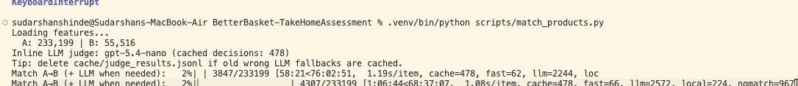
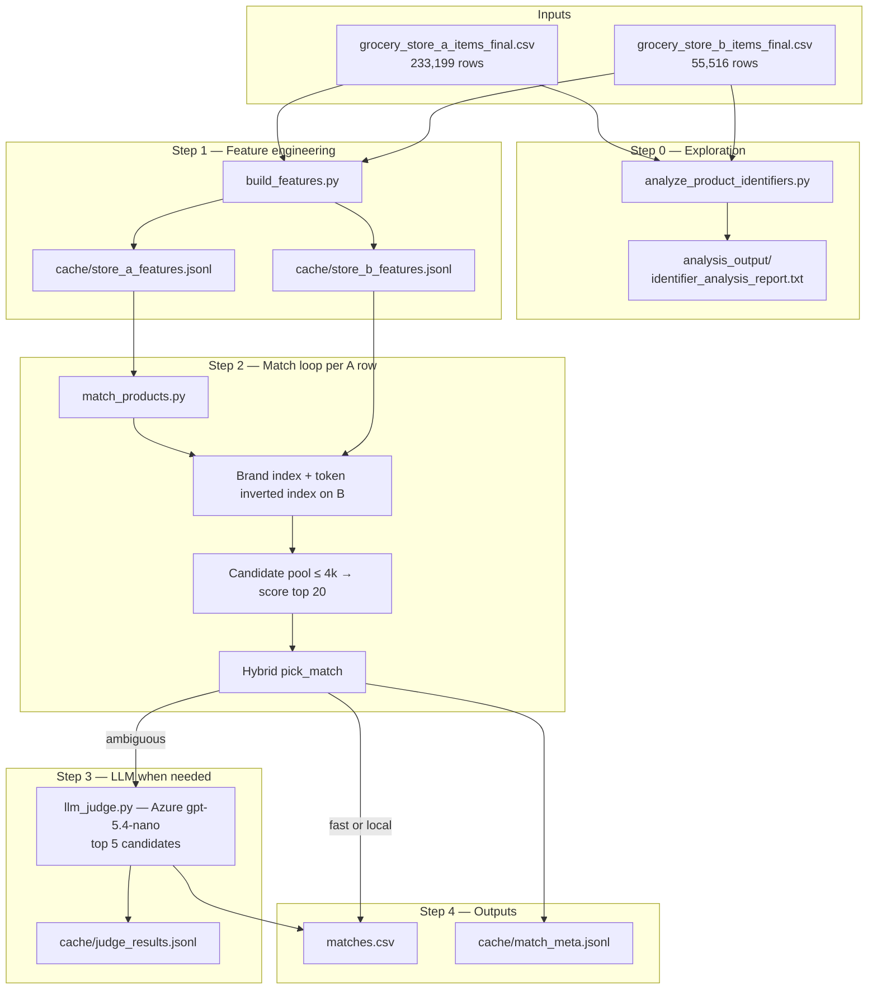
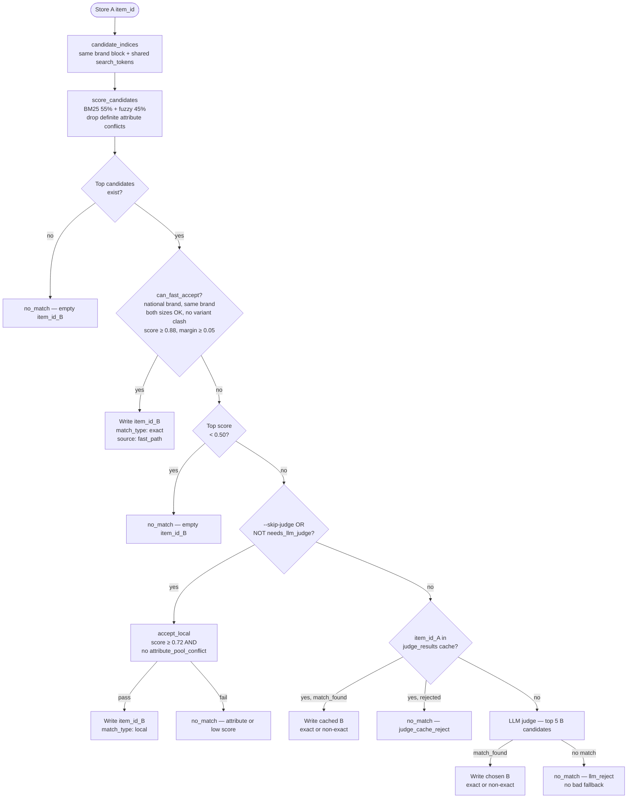
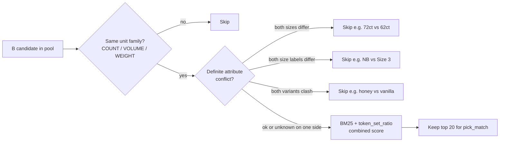

# BetterBasket — Grocery Product Matching (Take-Home)

Match each **Walmart (Store A)** product to the single closest **Wegmans (Store B)** product for competitive price indexing. This repository contains data exploration, a scalable Python matching pipeline, and incremental outputs (`matches.csv`).

**Store A:** `grocery_store_a_items_final.csv` — 233,199 rows  
**Store B:** `grocery_store_b_items_final.csv` — 55,516 rows  
**Deliverable:** `matches.csv` with `item_id_A`, `item_id_B` — **one row per Store A product** (233,199 when complete). Rows with **no** confident substitute use an **empty** `item_id_B` (non-match); use `scripts/export_matched_pairs.py` to write **`matches_only.csv`** (paired rows only).

Detailed pipeline design: [ARCHITECTURE.md](ARCHITECTURE.md)  
Script reference: [scripts/README.md](scripts/README.md)

---

## Run status (stopped early — time constraint)

We ran the full pipeline with the **hybrid router + inline Azure LLM judge** (`match_products.py`, not `--skip-judge`). The run was **stopped manually before completion** because a full pass at ~1 s/item with heavy LLM use was projected at **~68+ hours** remaining (see ETA below), and we were **short on time** for the submission deadline.

**What is in the repo today**

| Artifact | Status |
|----------|--------|
| Feature caches (`cache/store_*_features.jsonl`) | **Complete** (all A + B rows) |
| `matches.csv` | **Partial** — only the first ~4.5k Store A rows processed before stop (not all 233,199) |
| `cache/judge_results.jsonl` | Partial judge cache from the stopped run (resumable) |
| `matches_only.csv` | Optional export via `export_matched_pairs.py` (~687 paired rows from partial `matches.csv`) |

The **algorithm and code are complete**; the gap is **compute/time**, not missing implementation. Reviewers can resume or rerun locally (see below).

Command used:

```bash
.venv/bin/python scripts/match_products.py
```

**Startup (from terminal):**

- Store A: **233,199** rows | Store B: **55,516** rows  
- Inline LLM judge: **gpt-5.4-nano** (cached decisions at snapshot: **478**)

**Last progress snapshot** (when we stopped — [`progress.png`](progress.png)):



```
Match A→B (+ LLM when needed):  2%|▎  | 4307/233199 [1:06:44<68:37:07, 1.08s/item,
  cache=478, fast=66, llm=2572, local=224, nomatch=967
```

| Metric | Value at stop | Meaning |
|--------|----------------|---------|
| **Progress** | **~2%** | 4,307 / 233,199 Store A rows processed |
| **Elapsed** | **1:06:44** | ~1 hour before interrupt |
| **ETA (if continued)** | **~68:37:07** | Why we did not wait for full completion |
| **Speed** | **1.08 s/item** | Dominated by LLM on borderline rows |
| `fast` | **66** | National-brand auto-accept (no API) |
| `local` | **224** | High-confidence local top-1 (no API) |
| `llm` | **2,572** | New LLM API calls in this run |
| `cache` | **478** | Reused `judge_results.jsonl` |
| `nomatch` | **967** | Empty `item_id_B` in processed rows |

**Partial output stats** (check after clone):

```bash
wc -l matches.csv
.venv/bin/python scripts/export_matched_pairs.py
```

Roughly **~15%** of processed rows have a non-empty `item_id_B`; the rest are intentional non-matches. The assessment asks for **≥ 4,000** quality pairs over the **full** catalog — our committed `matches.csv` is a **partial slice** until a full rerun finishes.

**To complete the run later**

1. Back up `matches.csv` if you want to keep the partial file.  
2. Resume logic is not row-offset yet: restarting `match_products.py` opens `matches.csv` with `"w"` and **truncates**. To finish all 233k rows, rerun from scratch (feature + judge caches still save cost) or extend the script to append from the last `item_id_A`.  
3. Faster experiments only: `--skip-judge` or `--judge-max N` (lower quality on borderline rows).

---

## Problem framing

| Match type | Rule of thumb | How we handle it |
|------------|---------------|------------------|
| **Exact** | Same national brand, product, variant, size, form | Fast path (rules) + LLM label `exact` |
| **Non-exact** | Different brands (usually both **private label**), same shopper substitute | LLM label `non-exact`; local path may accept PL pairs without relabeling |
| **Not a match** | Wrong size, variant, or category (e.g. Honest NB 72 ct vs Size 3 62 ct) | Empty `item_id_B` |

Assessment requires **≥ 4,000** quality matches in the final CSV; the full matchable set is often larger than 10,000.

---

## Step 0 — Data analysis (what we learned)

We ran `scripts/analyze_product_identifiers.py` before building the matcher. Full report: [`analysis_output/identifier_analysis_report.txt`](analysis_output/identifier_analysis_report.txt).

### Key findings

1. **No cross-store UPC join** — After filtering noise, **0** GTIN/UPC codes appear in both A and B. A UPC-first exact stage is not viable on this scrape.
2. **No reliable shared product id** — Walmart/Wegmans URL ids are internal per retailer and do not align with `datapoint_id` / `raw_data_id`.
3. **Asymmetric data quality**
   - **A (Walmart):** `brand_raw` often empty; size frequently only in title; sparse `item_info`.
   - **B (Wegmans):** `brand_raw` and `sizing_comp` JSON are strong; `tags` help on ~23k rows.
4. **Schema differs** — Load by **column name** (e.g. A has `is_private_label`, B has `is_organic`).
5. **Categories are retailer-specific** — Used as soft hints only, not hard join keys.

**Conclusion:** Primary matching must use **brand + normalized text + size + variant signals + blocking**, with an LLM judge only for ambiguous rows.

---

## System architecture

We never score all A × B pairs (~12.9 billion). Each Walmart row gets a **small candidate set** from indexes built once over Wegmans, then local scoring and optional LLM judgment.

### End-to-end pipeline diagram



### How to read this diagram

| Stage | What happens | Cost |
|-------|----------------|------|
| **Step 0** | Confirms there is **no shared UPC** across stores and documents schema differences. Informs “no UPC-first stage.” | One-time, local |
| **Step 1** | Turns each raw CSV row into a **feature record** (brand, size, tokens, PL flag, etc.). B is parsed with rules; A uses B’s brand vocabulary + Walmart heuristics. | One-time, local |
| **Step 2** | For **each** A item: build a **candidate pool** from indexes (not full B), **rank** with BM25 + fuzzy, **decide** with hybrid rules (see next section). | O(A × K), K ≈ 20 |
| **Step 3** | Only when rules say “ambiguous”: send **one** LLM call with up to **5** B candidates. Results cached so reruns skip duplicate API cost. | ~60–70% of rows in current run |
| **Step 4** | Append one line to `matches.csv` per A row; optional debug row in `match_meta.jsonl`. | Disk only |

**Artifacts between runs:** Feature JSONL and `judge_results.jsonl` let you stop and restart without rebuilding everything. `matches.csv` is rewritten from scratch if you restart `match_products.py` without changing the script to resume (see *Current run status*).

---

## Decision flow (per Store A product)

This is the **hybrid router** inside `pick_match()` — how a single Walmart SKU becomes one line in `matches.csv`.

### Decision diagram



### Scoring sub-flow (inside `score_candidates`)

Before any decision node above, each candidate in the pool is filtered and ranked:



**Important:** BM25 runs **here**, on the **candidate pool**, using `search_tokens` from Step 1 — not on raw CSV text at load time.

### What `needs_llm_judge` means

After fast-path and garbage checks fail, we ask: “Is the top score **high enough** and **not a tie** that we can trust local top-1?”

| A / top B situation | Skip LLM (local OK) when… |
|---------------------|---------------------------|
| **Private label ↔ private label** | Top score ≥ **0.84** and second place is **≥ 0.05** behind |
| **National brand (or mixed)** | Top score ≥ **0.88** and margin ≥ **0.05** |
| **Any** | Top two scores within **0.05** → **always LLM** (tie-break) |

If `--skip-judge` is set, we **never** call the API; the same local branch runs, but borderline rows never get human-like judgment.

### Outcomes you see in the progress bar

| tqdm counter | Decision branch |
|--------------|-----------------|
| `fast` | `can_fast_accept` → exact-style national match |
| `local` | `accept_local` without LLM |
| `llm` | New API call this run |
| `cache` | Reused `judge_results.jsonl` entry |
| `nomatch` | Empty `item_id_B` (any reject path) |

---

## Algorithm steps (reference)

We use **retrieval → score → hybrid route → optional LLM**.

### Step 1 — Feature engineering (`build_features.py`)

Per-row JSONL caches with:

- `brand_normalized`, `is_private_label`, `size` (+ `unit_family`, `size_bucket`)
- `size_labels` (e.g. diaper Size NB vs Size 3)
- `variant_tokens` (flavor/scent keywords)
- `search_tokens` / `match_text` for retrieval and fuzzy match
- Coarse `department` / category from `item_info` / `tags`

Store B is parsed with **Python only**. Store A uses B’s brand vocabulary + Walmart PL heuristics + size extraction from name/`sizing_comp`.

### Step 2 — Retrieval (per A item)

1. **Brand block** — If A is national brand, only B rows with the same `brand_normalized`.
2. **Inverted index** — B candidates sharing product `search_tokens` (nouns from title).
3. **Cap** — Pool capped at 4,000; global fuzzy fallback (top 40) if the pool is empty. **No** “first row in B” fallback (removed after bad matches like frames → nail polish).

### Step 2b — Scoring (`score_candidates`)

On the candidate pool only:

- **BM25** (`rank_bm25`) on `search_tokens` — runs **after** feature build, **not** on raw CSV text.
- **RapidFuzz** `token_set_ratio` on `match_text`.
- **Combined score:** `0.45 × fuzzy + 0.55 × BM25`.
- **Hard gates (definite conflicts only):**
  - Unit family mismatch (COUNT vs VOLUME, etc.)
  - Both sides have size and differ (e.g. 72 ct vs 62 ct)
  - Both sides have size labels and differ (NB vs Size 3)
  - Both sides have variant tokens and clash (honey vs vanilla)
  - Unknown size on one side **does not** remove the candidate (sparse A metadata).

### Step 2c — Hybrid routing (`pick_match`)

Combines **earlier LLM cost control** with **stricter attribute safety** from iteration on bad matches.

| Stage | Condition | Action |
|-------|-----------|--------|
| **Fast path** | National brand, same brand, both sizes present & compatible, no variant clash, score ≥ **0.88**, margin ≥ **0.05** | Write B, type `exact`, source `fast_path` |
| **Garbage** | Score &lt; **0.50** | Empty `item_id_B` |
| **Local top-1** | `not needs_llm_judge` (or `--skip-judge`), score ≥ **0.72**, no pool conflict | Write B, type `local` |
| **LLM judge** | Borderline / tie per thresholds below | Top 5 candidates → Azure OpenAI |
| **LLM reject** | `match_found: false` | **Empty** (no fallback to a conflicting top-1) |

**`needs_llm_judge` (when judge enabled):**

- **Private label ↔ private label:** LLM if score &lt; **0.84** or top-two within **0.05**.
- **National / mixed:** LLM if score &lt; **0.88** or tie within **0.05**.

### Step 3 — LLM judge (`llm_judge.py`, inline)

- Model/deployment from `openai_creds.yaml` (gitignored).
- Returns JSON: `match_found`, `chosen_item_id_B`, `match_type` (`exact` | `non-exact` | `none`).
- Cached in `cache/judge_results.jsonl` for resume and cost control.

### Step 4 — Output

| File | Purpose |
|------|---------|
| `matches.csv` | Assessment deliverable (`item_id_A`, `item_id_B`) |
| `cache/match_meta.jsonl` | Per-row `source`, `match_type`, `score` (debugging / QA) |
| `cache/judge_results.jsonl` | Raw judge responses |

`matches.csv` is **flushed after each row** so partial runs are visible on disk.

---

## `matches.csv` vs matched pairs only

| File | Rows | Contents |
|------|------|----------|
| **`matches.csv`** | **233,199** (when run completes) | **Every** Store A `item_id` exactly once |
| Rows with `item_id_B` filled | Subset (~15–20% early in run; grows as run proceeds) | **Matched** A→B pairs |
| Rows with empty `item_id_B` | Remainder | **Non-matches** — no acceptable B (low score, LLM reject, or attribute conflict) |

The assessment pipeline **must** emit all A rows; empty B is intentional, not a bug. For analysis, reporting, or checking the **≥ 4,000 matches** bar, filter to paired rows only:

```bash
.venv/bin/python scripts/export_matched_pairs.py
# → matches_only.csv (same columns, only rows with item_id_B set)

# Custom paths
.venv/bin/python scripts/export_matched_pairs.py -i matches.csv -o analysis/matched_pairs.csv
```

The script prints counts: total A rows, matched, and non-match (empty B).

---

## Exact vs non-exact in our outputs

- **`matches.csv`** does not include a `match_type` column (assessment minimum schema). Every A row appears once; `item_id_B` may be blank (non-match).
- **Internal labels** in `cache/match_meta.jsonl`:
  - `exact` — fast path or LLM
  - `non-exact` — LLM (both PL, shopper substitute)
  - `local` — local high-confidence path (may be exact-like or PL substitute; not relabeled)
  - `no_match` — empty B

For submission QA, join `matches.csv` to `match_meta.jsonl` on `item_id_A` to audit types.

---

## Design choices & lessons (bugs we fixed)

| Issue | Fix |
|-------|-----|
| Corn → unrelated tea | Removed wide PL bucket; token index + BM25 on pool |
| Home decor → unrelated B SKU | Removed `b_list[0]` fallback |
| Honest diapers NB 72 → Size 3 62 | Definite size / size-label gates in scoring |
| LLM “no” but CSV still wrote bad B | Reject → empty `item_id_B` |
| `--skip-judge` at 0.70 only | Hybrid: local only with attribute gates + 0.72 floor |
| Empty `matches.csv` while running | Per-row `flush()` on CSV writer |

---

## Repository layout

```
BetterBasket-TakeHomeAssessment/
├── README.md                          # This file
├── ARCHITECTURE.md                    # Detailed design
├── requirements.txt
├── run_matching.py                    # Entry: features + match
├── scripts/
│   ├── build_features.py
│   ├── match_products.py              # Main matcher
│   ├── export_matched_pairs.py        # matches.csv → matches_only.csv
│   ├── matching_lib.py                # Rules, parsers, routing
│   ├── llm_judge.py
│   └── analyze_product_identifiers.py
├── matches_only.csv                   # Optional: export script output (paired rows only)
├── analysis_output/
│   └── identifier_analysis_report.txt
├── cache/                             # Generated (large; see .gitignore)
│   ├── store_a_features.jsonl
│   ├── store_b_features.jsonl
│   ├── judge_results.jsonl
│   └── match_meta.jsonl
├── matches.csv                        # Output (in progress)
├── grocery_store_*_final.csv          # Input (place locally; gitignored)
└── openai_creds.yaml                  # Azure creds (gitignored; see below)
```

---

## Setup & run

### 1. Environment

```bash
python3 -m venv .venv
.venv/bin/pip install -r requirements.txt
```

### 2. Data

Place assessment CSVs in the repo root (see `.gitignore` — not committed). Sample files can be used for smoke tests if you copy them without ignoring.

### 3. LLM credentials (full run with judge)

Create `openai_creds.yaml` at repo root:

```yaml
openai:
  api_key: "<your-azure-key>"
  endpoint: "https://<resource>.openai.azure.com/"
  deployment_name: "<deployment>"
```

### 4. Commands

```bash
# Full pipeline (features + match + LLM)
.venv/bin/python run_matching.py

# Or step by step
.venv/bin/python scripts/build_features.py
.venv/bin/python scripts/match_products.py

# Smoke test
.venv/bin/python scripts/match_products.py --limit 500

# Faster local-only (no API; lower precision on borderline rows)
.venv/bin/python scripts/match_products.py --skip-judge

# Cap new LLM calls (testing)
.venv/bin/python scripts/match_products.py --judge-max 100
```

Export paired matches only (from `matches.csv`):

```bash
.venv/bin/python scripts/export_matched_pairs.py
```

Re-run identifier analysis:

```bash
.venv/bin/python scripts/analyze_product_identifiers.py
```

---

## Assumptions

1. **One best B per A** — If Wegmans has no reasonable substitute, `item_id_B` is left empty rather than forcing a weak match.
2. **Non-exact** is primarily **private-label equivalence** at similar size/form; national-brand flavor mismatches are not exact.
3. **COUNT sizes** require the same integer count when both sides have a parsed count.
4. **LLM** is a scalpel for ambiguity, not a batch scorer over all pairs.
5. **Quality over coverage** for borderline national-brand SKUs; volume is recovered on clear PL and high-score national rows.

---

## Submission notes

- **Executable algorithm:** `run_matching.py` / `scripts/match_products.py` reproduces `matches.csv` given the input CSVs and feature caches.
- **Analysis artifact:** `analysis_output/identifier_analysis_report.txt` documents why we did not use UPC-first matching.
- **Partial `matches.csv`:** Submitted run was **stopped early (~2%, ~4.3k rows)** due to **time constraints** (~69h projected remaining at 1.08 s/item). Full 233,199-row output requires rerunning the matcher locally.
- **Paired rows only:** `scripts/export_matched_pairs.py` → `matches_only.csv` for rows with a non-empty `item_id_B`.
- **Secrets:** Do not commit `openai_creds.yaml`.


Built for the BetterBasket engineering take-home — Walmart ↔ Wegmans product matching at scale.
